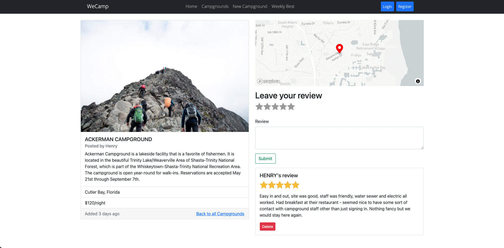

# WeCamp

WeCamp is a web application where users can create and review campgrounds. In order to review or create a campground, you must have an account.

## Explore the APP!
> See this app in action at [https://thewecamp.herokuapp.com/](https://thewecamp.herokuapp.com/)  
***\**NOTE: It may take a few seconds to load the website since the Heruko platform features limitation, please be patient!***

You can try to create your own user and test with the functionality of the website, your data will not be used for any other purpose excpet for authentication of the website.

## Features
* Basic view
  * Users can create, edit, and remove campgrounds.
  * Users can leave reviews on campgrounds' show page.
  * Users can view the best rated websites of the week.
  
* Authentication
  * Users can sign up or login using username and password.
  * User can not submit campgrounds if they are not logged in.

* Authorization
  * User can only modify campgrounds created by them.
  
## Stacks

### Front end
* [HTML](https://en.wikipedia.org/wiki/HTML5)

* [Bootstrap](https://getbootstrap.com)

* [ejs](https://ejs.co/)

### Back End
* [Node. js](https://nodejs.org)

* [Express. js](https://expressjs.com)

* [MongoDB](https://www.mongodb.com/)

* [passport](http://www.passportjs.org/)

* [passport-local](https://github.com/jaredhanson/passport-local#passport-local)

* [express-session](https://github.com/expressjs/session#express-session)

* [method-override](https://github.com/expressjs/method-override#method-override)

* [connect-flash](https://github.com/jaredhanson/connect-flash#connect-flash)

* [dotenv](https://www.npmjs.com/package/dotenv)

* [body-parser](https://www.npmjs.com/package/body-parser)

* [connect-mongo](https://www.npmjs.com/package/connect-mongo)

### Database
* [mongoose](http://mongoosejs.com/)

### Map
* [Mapbox](https://www.mapbox.com/)

### Image Storage
* [Cloudinary](https://cloudinary.com/)

### Deployment
* [Heroku](https://www.heroku.com/)
